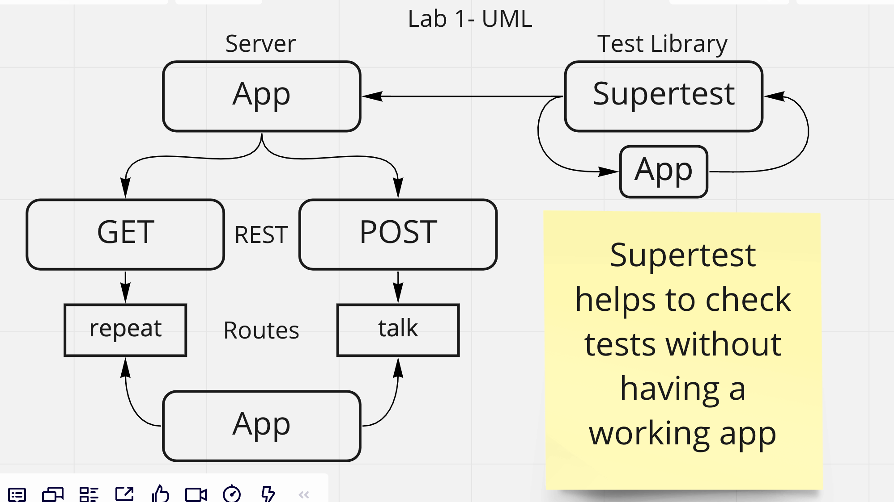

# server-development-practice

## Author

Antoine Charette

## Installation

## Summary of Problem Domain

## Links to Application Deployment

### Branch

#### dev

[Heroku](https://antoine-server-deploy-dev.herokuapp.com/)

[Actions Page](https://github.com/DevAOC/server-development-practice/actions/runs/1357224609)

[PR](https://github.com/DevAOC/server-development-practice/pull/1)

#### main

[Heroku](https://antoine-server-deploy-prod.herokuapp.com/)

[Actions Page](https://github.com/DevAOC/server-development-practice/actions/runs/1357224609)

## Include Embedded UML

## Routes

- HTTP GET

  - Path: /repeat
    - responds with the last string used in post route `/talk`.

- HTTP POST
  - Path: /talk
    - Accepts a string.
    - responds with a string in all caps.
